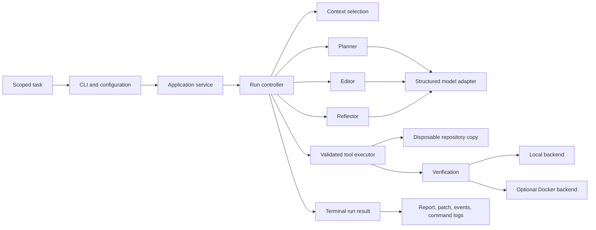

# RepoPilot

RepoPilot is a constrained coding agent that turns one narrowly scoped repository task into a
tested, reviewable patch and an inspectable execution report.

It is an engineering study in dependable agent orchestration: typed model outputs, explicit state
transitions, bounded tools, disposable workspaces, verification-driven retries, optional Docker
isolation, durable evidence, and an honest evaluation harness. It is not a general autonomous IDE or
a production security boundary.

## Why RepoPilot

- **Bounded autonomy:** runtime, model calls, tool calls, and edit iterations have hard limits.
- **Evidence before mutation:** the model inspects through typed tools and can only submit a
  constrained Git-style patch against a disposable copy.
- **Observable outcomes:** every run records its patch, report, state transitions, command logs,
  usage, timing, context measurements, and termination reason.
- **Failure-aware evaluation:** expected safety failures and genuinely successful tasks are reported
  as different metrics.

## Run the deterministic demo

RepoPilot requires Python 3.12 or newer. The demo runs the real controller, repository boundary,
tools, patch application, pytest verification, and artifact writer with a scripted model, so it needs
no API key or network access after installation.

```bash
git clone https://github.com/smaahika/RepoPilot.git
cd RepoPilot
python3 -m venv .venv
source .venv/bin/activate
python -m pip install --editable '.[dev]'
python scripts/demo.py
```

Expected excerpt:

```text
RepoPilot deterministic demo
Task: Change greeting() to return hello RepoPilot.
Result: success
Changed files: greeting.py
Verification: passed
Iterations: 1; model calls: 3; tool calls: 4
Artifacts: commands/001-test.log, events.jsonl, patch.diff, report.md
```

The demo prints the generated unified diff and is verified by an integration test. The complete
transcript and a 60–90 second walkthrough are in the [demo guide](docs/demo.md).

To retain the generated fixture and run artifacts at a new path for inspection:

```bash
python scripts/demo.py --output-dir /tmp/repopilot-demo
```

## Architecture



The controller—not the model—owns state transitions, budgets, tool dispatch, retries, and
termination. Provider adapters only transport structured requests and normalize responses.

| Boundary | Responsibility |
| --- | --- |
| Model | Return a validated plan, one tool call, or one reflection |
| Controller | Decide what may happen next and account for every operation |
| Tools | Enforce path, patch, command, timeout, and output policies |
| Workspace | Keep all edits away from the source repository |
| Verification | Convert diffs and command exits into stable outcomes |
| Artifact writer | Persist bounded, redacted terminal evidence atomically |

See the full [architecture](docs/architecture.md) and
[design decision log](docs/design-decisions.md).

## Run against a repository

Export an API key and provide exactly one local path or credential-free public HTTPS repository. The
optional verification command is an argument vector and must appear last.

```bash
export OPENAI_API_KEY="your-key"
repopilot run \
  --local-repo /path/to/repository \
  --task "Add a CLI flag and document it." \
  --verify pytest -q
```

RepoPilot copies the source into `~/.repopilot/workspaces`, operates only on that copy, removes the
workspace after termination, and leaves the source unchanged. Durable evidence remains under
`~/.repopilot/runs/<run-id>`:

```text
runs/<run-id>/
├── report.md
├── patch.diff
├── events.jsonl
└── commands/
    └── 001-test.log
```

## Optional Docker verification

Local command execution is the default. To run allowlisted verification commands in the reference
Python sandbox:

```bash
docker build --tag repopilot-sandbox:py312 docker
repopilot run \
  --execution-backend docker \
  --local-repo /path/to/repository \
  --task "Add a CLI flag and document it." \
  --verify pytest -q
```

The container has no network, a read-only repository mount, a writable temporary filesystem,
dropped capabilities, no-new-privileges, and CPU, memory, PID, output, and runtime limits. Docker
still shares the host kernel; read the [threat model](docs/docker-sandbox.md) before treating it as
an isolation control.

## Evaluation baseline

Run all eight offline cases with:

```bash
python scripts/evaluate.py
```

| Metric | Scripted replay v1 |
| --- | ---: |
| Expected behaviors matched | 8/8 |
| Tasks that actually succeeded | 6/8 (75%) |
| Model calls | 24 |
| Tool calls | 31 |
| Edit iterations | 8 |
| Context characters | 9,984 before → 12,462 after |

The two unsuccessful tasks intentionally exercise invalid-patch rejection and retry-budget
exhaustion. They match their expected behavior but remain failed tasks. The small fixtures also show
that context metadata can cost more than it saves; large-input stress tests show the opposite. See
the [evaluation methodology](docs/evaluation.md) and
[checked baseline](evaluation/results/baseline.json).

Scripted replay measures orchestration regressions, not real-model coding ability. No provider token
usage is invented when a scripted model reports none.

## Engineering tradeoffs

| Decision | Benefit | Cost |
| --- | --- | --- |
| One model-selected tool per turn | Deterministic ordering and accounting | More model round trips |
| Disposable repository copies | Source isolation and clean diffs | Additional disk and copy time |
| Pydantic at external boundaries | Runtime rejection of malformed data | Schema and serialization overhead |
| Heuristic context selection | Fast, reproducible, provider-neutral | Can omit useful evidence or add small-input overhead |
| Local execution by default | Works without Docker | Not a security sandbox |
| Scripted offline benchmark | Stable, cheap regression signal | Not a model-capability score |

## Current limitations

- Only standard Git working trees and credential-free public HTTPS clones are supported.
- Command execution is restricted to a small verification allowlist.
- The reference Docker image targets Python projects and is not a hardened multi-tenant sandbox.
- Context ranking uses filenames and task terms rather than semantic embeddings.
- The baseline is deterministic scripted replay; repeated live-model trials are future work.
- RepoPilot produces a patch for review and never applies it back to the source repository.
- The project is pre-release (`0.1.0.dev0`) and does not yet include its final CI/security workflow
  or open-source license.

## Development checkpoint

Install development dependencies and run the complete local release check:

```bash
python -m pip install --editable '.[dev]'
python scripts/check.py
```

The checkpoint verifies formatting, lint, strict typing, unit and integration tests, wheel creation,
installation into a clean virtual environment, and the installed CLI entry point.

## Documentation

- [Product and system design](docs/design.md)
- [Architecture and trust boundaries](docs/architecture.md)
- [Design decisions](docs/design-decisions.md)
- [Deterministic demo guide](docs/demo.md)
- [Docker threat model](docs/docker-sandbox.md)
- [Context management](docs/context-management.md)
- [Evaluation methodology](docs/evaluation.md)
- [MVP checkpoint](docs/mvp-checkpoint.md)
- [Implementation backlog](BACKLOG.md)
