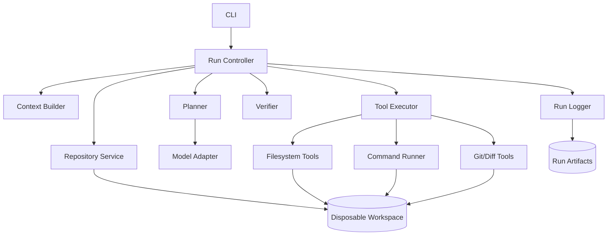
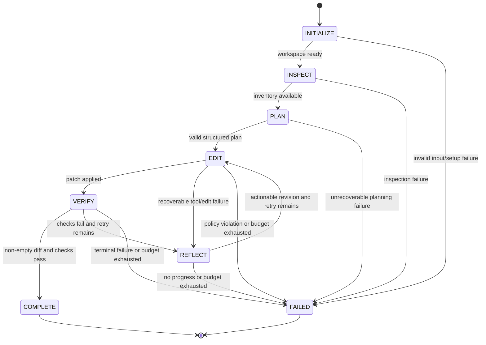

# RepoPilot Architecture

## Design principles

1. **Control is deterministic.** The controller owns state transitions, budgets, and termination.
2. **Model output is data.** Plans and tool calls are parsed into versioned schemas before use.
3. **Capabilities are narrow.** Tools expose specific bounded operations instead of a raw shell.
4. **Failure is a product output.** Every run should explain what failed and preserve useful evidence.
5. **Provider and sandbox details are replaceable.** Interfaces isolate volatile integrations from
   orchestration logic.

## Component view



The controller coordinates components but does not implement their low-level behavior. Repository
setup, model calls, tool execution, verification, and artifact persistence will each have typed
interfaces so deterministic fakes can exercise orchestration without network or model access.

## Execution lifecycle



All edges are explicit in a transition table. A model may propose an action, but it cannot choose a
state transition. The controller validates the current state, event, and remaining budgets before
moving to the next state.

## State responsibilities

| State | Responsibility | Exit evidence |
| --- | --- | --- |
| `INITIALIZE` | Validate request and create workspace/run directory | Valid request and workspace metadata |
| `INSPECT` | Inventory repository and build bounded initial context | Inventory and project signals |
| `PLAN` | Request and validate a structured plan | At least one valid plan step |
| `EDIT` | Execute approved read/search/patch actions | Tool results and current diff |
| `VERIFY` | Run allowed checks and normalize results | Verification summary |
| `REFLECT` | Ask for a bounded correction after recoverable failure | Revised action or no-progress signal |
| `COMPLETE` | Finalize successful artifacts | Passing checks and non-empty patch |
| `FAILED` | Finalize partial artifacts with a reason | Typed termination reason |

## Dependency direction

The domain layer contains request, plan, tool, state, budget, and result models. It depends on no
provider SDK or subprocess implementation. Application orchestration depends on domain interfaces.
Adapters implement repository, model, process, and logging interfaces at the outer edge.

```text
CLI/adapters -> application controller -> domain models and policies
```

This direction makes the controller testable using an in-memory workspace, scripted model, fake
clock, and deterministic command runner. Provider-specific exceptions must be translated at the
adapter boundary.

## Planned source layout

```text
src/repopilot/
├── cli.py                 # Argument parsing and presentation only
├── config.py              # Environment and bounded runtime configuration
├── composition.py         # Production adapter wiring
├── application.py         # Execution and artifact application services
├── artifacts.py           # Bounded atomic run persistence
├── sandbox.py             # Optional Docker command backend
├── models.py              # Pydantic boundary/domain schemas
├── model_models.py        # Structured model requests, plans, calls, and usage
├── model_client.py        # Provider-neutral structured generation protocol
├── openai_model.py        # Direct OpenAI Responses API adapter
├── scripted_model.py      # Deterministic model test double
├── run_models.py          # Run inputs, budgets, counters, events, and results
├── controller.py          # Orchestration and transition decisions
├── state_machine.py       # States, events, and legal transition table
├── planner.py             # Provider-neutral planning interface
├── editor.py              # Provider-neutral single-action selection
├── reflection.py          # Structured correction after failed verification
├── verification.py        # Normalized check outcomes and classification
├── tool_executor.py       # Exhaustive validated tool-call dispatch
├── context.py             # Bounded context selection
├── policies.py            # Path, command, and budget policy
├── tools/
│   ├── filesystem.py
│   ├── shell.py
│   └── git.py
├── verification.py
└── run_logging.py         # Avoid shadows of the standard logging module
```

Implemented repository-boundary modules now include `models.py`, `errors.py`, `path_policy.py`,
`workspace.py`, `git_client.py`, and `repository.py`. Remaining modules will be added alongside
their Day 4–6 behavior. Empty architectural placeholders are intentionally avoided because they
create interfaces without evidence.

Day 3 adds `process.py`, `tool_models.py`, and the `tools/` package. Pydantic request schemas reject
unknown fields and enforce caller-facing limits. Every invoked tool returns a normalized result
with its name, duration, typed data, or a stable error category.

Day 4 adds a generic structured-generation protocol whose caller supplies the expected Pydantic
output type. The planner owns prompt construction and inventory serialization; provider adapters
only transport the request, validate the response, normalize usage, and translate failures. The
scripted adapter uses the same validation path and records invocations for deterministic controller
tests.

The first provider implementation uses OpenAI's Responses API with structured outputs. It disables
SDK retries so the future controller remains the single owner of retry budgets, applies an explicit
request timeout, and opts out of response storage. Provider response objects and exceptions do not
cross the adapter boundary.

## Controller vertical slice

Day 5 implements the first complete controller path:

```text
workspace → checkout/inventory → plan → tool actions → patch → diff/checks → cleanup → result
```

`state_machine.py` contains the complete transition table for this slice. The model selects one
validated tool call at a time, but the controller dispatches it, consumes budgets, records the
result, and chooses the next event. Successful inspection tools produce an explicit `EDIT → EDIT`
transition; only a successful patch can enter `VERIFY`.

Run budgets cover elapsed time, model calls, tool calls, and edit iterations. Counters are consumed
before an external operation, so a call that would exceed its count limit never starts. Provider
usage is accumulated separately from call counts. The editor receives only the three most recent
bounded observations; ranking and richer compaction remain deferred.

The verifier requires a non-empty diff and, when supplied, an allowlisted command with exit code
zero. Transition records remain available through the logging protocol and are serialized as
versioned JSONL by the outer persistence application after the run reaches a terminal state.

The controller delays the final `COMPLETE` transition until workspace cleanup succeeds. Source
repositories remain unchanged, durable run directories survive cleanup, and expected failures
return a terminal result with bounded counters and categorized failure details.

## Verification and retry loop

Day 6 normalizes raw command execution into four outcomes: `passed`, `failed`, `timeout`, and
`error`. A nonzero check exit is a normal failed verification rather than a tool failure. Timeouts
remain separately measurable, while policy, spawn, and other execution errors are terminal because
an edit cannot repair the configured command.

Recoverable verification failures transition from `VERIFY` to `REFLECT`. The reflector receives a
bounded diff and command evidence and returns a structured diagnosis plus one next step. The
controller consumes a model-call budget before reflection, records the response, and alone decides
whether `REFLECT → EDIT` is legal. The next editor request includes that diagnosis.

Each successful patch starts one verification iteration. After a failed check, the controller
compares the visible diff with the preceding failed attempt. Two consecutive failed iterations with
the same diff terminate as `no_progress`; reaching the configured iteration ceiling terminates as
`budget_exhausted`. The result preserves verification and reflection histories plus a first-class
termination reason for reporting and benchmarks.

The deterministic retry fixture intentionally produces an incorrect first patch, captures the
pytest failure, reflects, applies a corrected patch, and passes on its second iteration. The same
test verifies that the original source repository is unchanged.

## Exception and transition boundary

Expected repository, model, policy, validation, and budget failures retain actionable messages and
map to explicit termination reasons. Unexpected dependency exceptions are caught only at the run
boundary, sanitized to their exception type, and returned as `internal_error`; process-control
signals such as `KeyboardInterrupt` remain outside that boundary.

Transition recording validates the next state and writes to the injected logger before mutating the
state machine. If logging raises, the recorder disables the failed logger and the controller creates
an internal `FAILED` transition. A run therefore cannot report `COMPLETE` when its success transition
was not recorded.

## Repository preparation and baseline

```text
trusted base/
├── workspaces/<run-id>/
│   ├── repository/       # copied or cloned working tree
│   └── baseline.git/     # RepoPilot-owned object database and index
└── runs/<run-id>/        # durable artifacts; preserved during workspace cleanup
```

For a local source, the repository service copies the complete working tree so the source remains
untouched. Public sources must use credential-free HTTPS URLs before cloning is delegated to the
bounded Git adapter. Standard Git working trees with a real `.git` directory are supported
initially; linked worktrees and submodules remain explicit limitations.

RepoPilot asks the copied repository's Git index which tracked and non-ignored untracked paths are
visible, validates each path, and snapshots those contents into its own bare Git directory. This
separate baseline has two important properties:

1. dirty or untracked user files present at preparation time become part of the baseline; and
2. generating RepoPilot's diff never stages files in the copied repository's own index.

Before every diff, the private index is reset to the immutable baseline tree. Visible new files are
marked intent-to-add, after which Git produces a binary-capable unified diff. Repeated calls cannot
retain stale index entries from previous inspections.

The repository service owns the system-wide inventory ceiling. It applies the limit during initial
baseline capture, later inventory requests, and diff preparation so excessive repositories are
rejected before expensive snapshot work begins.

## Tool and process boundary

```text
untrusted arguments
       │
       ▼
Pydantic request schema
       │
       ▼
path / patch / command policy
       │
       ▼
bounded implementation
       │
       ▼
ToolResult[data | typed error]
```

Read tools expose deterministic listings, bounded UTF-8 line reads, exact search, and time-bounded
regular-expression search. Regex matching runs in an isolated Python child process so pathological
patterns can be terminated without blocking the future controller.

Patch writes accept a constrained Git-style unified diff. RepoPilot validates every declared path,
rejects Git metadata, traversal, rename/copy metadata, and symlink creation, then runs `git apply
--check` before applying the patch. The workspace's original Git index remains untouched.

Commands match explicit prefixes such as `pytest`, `ruff check`, `mypy`, and selected npm scripts.
They use a validated repository-relative working directory, a stripped environment, no shell,
streaming output caps, monotonic deadlines, and POSIX process-group termination. A nonzero exit is
command data rather than a tool error; the verifier will interpret whether that means tests failed.

The local command runner is a capability boundary, not a security sandbox. The optional Docker
backend retains command policy while adding a read-only mount, network denial, dropped capabilities,
no-new-privileges, tmpfs, and CPU, memory, PID, output, and runtime limits. It uses the same backend
interface as local execution, so controller behavior does not branch on isolation details.

Docker still shares the host kernel and trusts the Docker daemon and selected image. Resource
enforcement varies by platform, and read-only mounts are incompatible with suites that require
in-tree build output. The complete threat boundary is documented in `docs/docker-sandbox.md`.

## Run artifacts

Each run receives a unique directory separate from its disposable repository workspace:

```text
runs/<run-id>/
├── report.md
├── patch.diff
├── events.jsonl
└── commands/
    └── <sequence>-<command>.log
```

Events are ordered, schema-versioned records with monotonic elapsed timing. Large command output is
stored in a bounded log instead of duplicated in the report. Known process secrets are redacted
before data is written, new artifact directories default to owner-only access, and finalization runs
on both successful and failed paths.

## Known Day 1 uncertainties

- Supported project types and command-detection rules will be narrowed during verification work.
- Live Docker behavior and cross-platform enforcement require validation on a Docker-enabled host.
- Patch application may use a Git subprocess or a Python implementation; Day 2 tests should drive
  that choice.
- Context ranking and model prompt shape require benchmark evidence and remain deferred.
