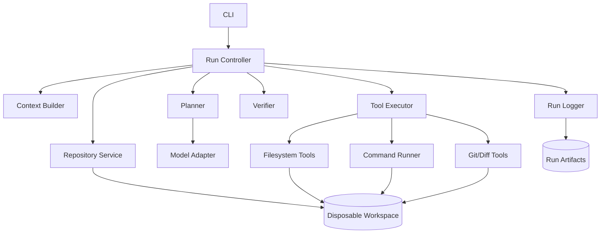
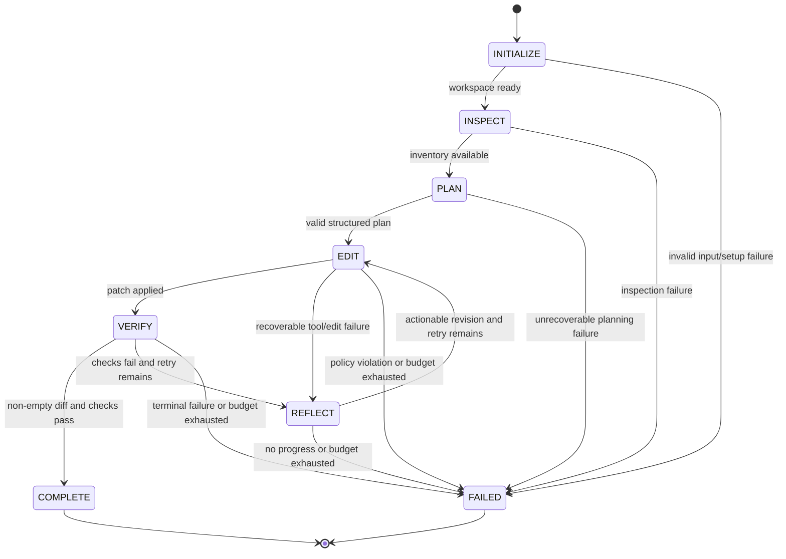

# RepoPilot Architecture

## Design principles

1. **Control is deterministic.** The controller owns state transitions, budgets, and termination.
2. **Model output is data.** Plans and tool calls are parsed into versioned schemas before use.
3. **Capabilities are narrow.** Tools expose specific bounded operations instead of a raw shell.
4. **Failure is a product output.** Every run should explain what failed and preserve useful evidence.
5. **Provider and sandbox details are replaceable.** Interfaces isolate volatile integrations from
   orchestration logic.

## Component view



The controller coordinates components but does not implement their low-level behavior. Repository
setup, model calls, tool execution, verification, and artifact persistence will each have typed
interfaces so deterministic fakes can exercise orchestration without network or model access.

## Execution lifecycle



All edges are explicit in a transition table. A model may propose an action, but it cannot choose a
state transition. The controller validates the current state, event, and remaining budgets before
moving to the next state.

## State responsibilities

| State | Responsibility | Exit evidence |
| --- | --- | --- |
| `INITIALIZE` | Validate request and create workspace/run directory | Valid request and workspace metadata |
| `INSPECT` | Inventory repository and build bounded initial context | Inventory and project signals |
| `PLAN` | Request and validate a structured plan | At least one valid plan step |
| `EDIT` | Execute approved read/search/patch actions | Tool results and current diff |
| `VERIFY` | Run allowed checks and normalize results | Verification summary |
| `REFLECT` | Ask for a bounded correction after recoverable failure | Revised action or no-progress signal |
| `COMPLETE` | Finalize successful artifacts | Passing checks and non-empty patch |
| `FAILED` | Finalize partial artifacts with a reason | Typed termination reason |

## Dependency direction

The domain layer contains request, plan, tool, state, budget, and result models. It depends on no
provider SDK or subprocess implementation. Application orchestration depends on domain interfaces.
Adapters implement repository, model, process, and logging interfaces at the outer edge.

```text
CLI/adapters -> application controller -> domain models and policies
```

This direction makes the controller testable using an in-memory workspace, scripted model, fake
clock, and deterministic command runner. Provider-specific exceptions must be translated at the
adapter boundary.

## Planned source layout

```text
src/repopilot/
├── cli.py                 # Argument parsing and presentation only
├── config.py              # Environment and bounded runtime configuration
├── models.py              # Pydantic boundary/domain schemas
├── controller.py          # Orchestration and transition decisions
├── state_machine.py       # States, events, and legal transition table
├── planner.py             # Provider-neutral planning interface
├── context.py             # Bounded context selection
├── policies.py            # Path, command, and budget policy
├── tools/
│   ├── filesystem.py
│   ├── shell.py
│   └── git.py
├── verification.py
└── run_logging.py         # Avoid shadows of the standard logging module
```

Modules will be added when their Day 2–6 behavior is implemented. Empty architectural placeholders
are intentionally avoided because they create interfaces without evidence.

## Run artifacts

Each run receives a unique directory separate from its disposable repository workspace:

```text
runs/<run-id>/
├── report.md
├── patch.diff
├── events.jsonl
└── commands/
    └── <sequence>-<command>.log
```

Events are append-only, timestamped, schema-versioned records. Large command output is stored in a
bounded log and referenced by events instead of duplicated. Secret redaction occurs before data is
written, and finalization runs on both successful and failed paths.

## Known Day 1 uncertainties

- Supported project types and command-detection rules will be narrowed during verification work.
- Docker availability and cross-platform behavior need a spike before becoming a requirement.
- Patch application may use a Git subprocess or a Python implementation; Day 2 tests should drive
  that choice.
- Context ranking and model prompt shape require benchmark evidence and remain deferred.
